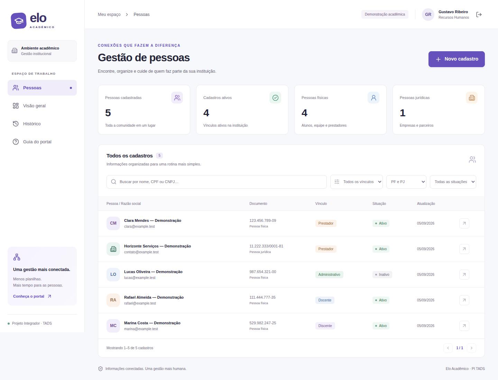

# Portal Elo Acadêmico

Aplicação Web para centralizar cadastros de pessoas físicas e jurídicas de uma instituição acadêmica. Secretaria e RH podem pesquisar, cadastrar e atualizar pessoas, com revisão antes de salvar e histórico de alterações.

**Projeto Integrador TADS — Desenvolvimento de Sistemas Orientados a Dispositivos Móveis e Baseados na Web.** Prova de conceito com dados fictícios, autenticação, frontend React e backend Next.js com SQLite.



## Equipe

- [MikaHayakun](https://github.com/MikaHayakun)
- [juanossilva1](https://github.com/juanossilva1)

## Executar localmente

Requisitos: **Node.js 24.15 ou superior na série 24**, npm e Git. O SQLite é fornecido pelo Node; não é necessário instalar um servidor de banco, PHP ou MySQL.

```bash
git clone https://github.com/MikaHayakun/portal-elo-academico.git
cd portal-elo-academico
npm ci
npm run setup
npm run dev
```

Acesse **http://localhost:3000**. O setup cria o banco `data/elo.sqlite`, cinco cadastros fictícios e duas contas. As senhas aleatórias ficam no arquivo local `.env.local`:

| Conta               | Senha no `.env.local`   | Permissões                                                              |
| ------------------- | ----------------------- | ----------------------------------------------------------------------- |
| `admin@elo.local`   | `ELO_ADMIN_PASSWORD`    | Consultar, cadastrar, editar, ativar/inativar e consultar histórico     |
| `gustavo@elo.local` | `ELO_OPERATOR_PASSWORD` | Consultar, cadastrar pessoas ativas, editar dados e consultar histórico |

Abra `.env.local` no editor para consultar as senhas. Não publique esse arquivo. O setup é repetível: preserva registros e senhas existentes; alterar a variável posteriormente não redefine a senha do usuário já criado.

Para testar a versão otimizada:

```bash
npm run build
npm start
```

O servidor escuta somente em `127.0.0.1`. `APP_ORIGIN` deve coincidir com o endereço usado no navegador, incluindo protocolo e porta. Para usar outro endereço ou hospedar o sistema, configure essa variável e a interface do servidor explicitamente. Uma hospedagem precisa de processo Node e disco persistente; o SQLite local não deve ser colocado em filesystem efêmero ou compartilhado entre réplicas.

## O que funciona

- Login com senha armazenada como hash scrypt e sessão com expiração de oito horas.
- Cadastro PF/PJ, vínculo institucional, situação, contato e observações.
- Validação de CPF e CNPJ **numérico**, unicidade de documento e campos obrigatórios.
- Busca por nome, nome social ou documento, filtros combinados e paginação.
- Edição com revisão/confirmação e cancelamento sem persistência.
- Histórico com responsável, horário e valores anteriores/novos.
- Proteção contra edição concorrente por versão do registro.
- Indicadores calculados a partir do banco, visão geral e guia de uso.
- Layout responsivo, controles por teclado e mensagens de erro/sucesso.

A demonstração acompanha **a rotina de Gustavo, do RH, ao consultar e atualizar o cadastro de um prestador**. Os dados iniciais são fictícios e servem apenas para demonstração.

## Tecnologias e organização

Next.js App Router, React, TypeScript, HTML semântico e CSS próprio; Zod para validação compartilhada, Lucide para ícones, SQLite nativo para persistência, Playwright para testes de navegador, axe-core para verificações automatizadas de acessibilidade, ESLint e Prettier para qualidade do código. As versões exatas estão no `package-lock.json`.

```text
src/app/             páginas, estilos e rotas HTTP
src/components/      portal, login e formulário reutilizável
src/lib/             regras, banco, autenticação e respostas HTTP
scripts/             preparação, testes e captura de demonstração
tests/               testes de domínio e navegador
docs/                requisitos, arquitetura, entrega e evidências
data/                banco local (não versionado)
```

O backend usa rotas do próprio Next.js. Um único projeto reduz duplicação de configuração e permite compartilhar tipos e validações. O CSS mantém a identidade visual sem dependência de um framework de estilos. Não há necessidade de acrescentar outra linguagem de backend à PoC.

## Verificações

```bash
npm run check
npx playwright install chromium
npm run test:e2e
npm run format:check
```

Os testes de navegador usam banco temporário independente, servidor na porta 3100 e credenciais exclusivas de teste. Não alteram `data/elo.sqlite`. O build deve existir antes de `test:e2e`. No Linux, se houver bibliotecas de navegador ausentes, utilize `npx playwright install --with-deps chromium` com a autorização administrativa do ambiente.

O workflow de GitHub Actions executa lint, tipos, testes, build, formatação e testes de navegador. Consulte [evidências e limites da validação](docs/VALIDACAO.md).

## Entrega acadêmica

- [Requisitos, revisão da ideação e rastreabilidade](docs/REQUISITOS.md)
- [Arquitetura, entidades e DER](docs/ARQUITETURA.md)
- [Checklist da rubrica e roteiro do vídeo](docs/ENTREGA.md)
- [Vídeo demonstrativo, até um minuto](docs/demo-projeto.mp4)
- [Guia de contribuição](CONTRIBUTING.md)

Os perfis GitHub divulgados com autorização estão na seção Equipe. Os materiais acadêmicos de origem permanecem na pasta local restrita. A versão pública não reproduz PDFs, banco de dados local, credenciais ou lista nominal extraída dos documentos.

Para a entrega ao professor, a equipe deve incluir a identificação dos integrantes no material restrito e registrar suas contribuições reais no GitHub. Os perfis dos demais integrantes ainda precisam ser informados. A presença na seção Equipe não substitui o registro das contribuições. Essa pendência impede considerar integralmente atendido o item de colaboração da rubrica.

## Limites desta prova de conceito

Cada cadastro possui um vínculo principal; PJ é limitada a prestador. Não inclui integração com sistemas acadêmicos externos, importação, exclusão definitiva, cadastro público de usuários, recuperação de senha, gestão de contas pela interface ou CNPJ alfanumérico. A busca textual usa o comportamento de caixa do SQLite e não remove acentos. O histórico exibe os últimos 100 eventos por consulta. A lista usa oito registros por página.

As contas são provisionadas pelo setup. Uma implantação institucional exige ampliar o gerenciamento de usuários, recuperação de acesso, autorização por setor, rotina de backup/restauração e operação com HTTPS. A PoC não representa uma certificação de segurança ou conformidade institucional.

Fontes técnicas: [Next.js — instalação](https://nextjs.org/docs/app/getting-started/installation) e [Node.js — SQLite](https://nodejs.org/api/sqlite.html). Os PDFs de orientação da disciplina foram usados como referência local e não foram republicados neste repositório.
