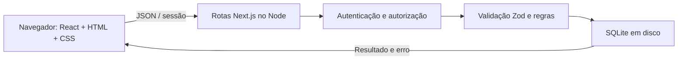
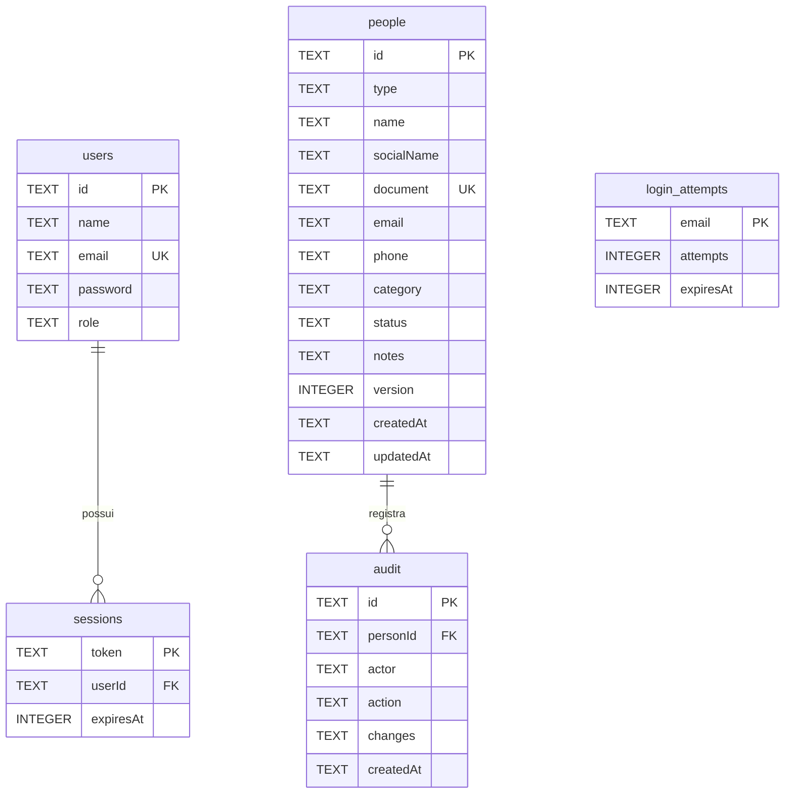

# Arquitetura e modelo de dados

## Fluxo técnico

As rotas HTTP usam Node.js. Dados persistem em `data/elo.sqlite`, fora do Git. Não há mock no fluxo funcional. A carga inicial é sintética, gravada no mesmo banco e acessada pelas mesmas rotas. O processo servidor deve ter acesso a disco persistente. O frontend compartilha com o backend o esquema de validação; a validação definitiva permanece no servidor.

## Entidades e atributos

| Entidade         | Significado e atributos                                                                                                                                                                                                                                                                                                                       |
| ---------------- | --------------------------------------------------------------------------------------------------------------------------------------------------------------------------------------------------------------------------------------------------------------------------------------------------------------------------------------------- |
| `users`          | Operadores autenticados: `id` identificador; `name` nome apresentado/auditoria; `email` login único; `password` hash com salt; `role` admin ou operator                                                                                                                                                                                       |
| `sessions`       | Acesso temporário: `token` hash do token aleatório; `userId` usuário associado; `expiresAt` instante de expiração em milissegundos                                                                                                                                                                                                            |
| `people`         | Cadastro institucional: `id`; `type` PF/PJ; `name` nome civil ou razão social; `socialName` nome social de PF; `document` CPF/CNPJ sem máscara e único; `email` contato; `phone` telefone; `category` vínculo principal; `status` ativo/inativo; `notes` observações; `version` controle de concorrência; `createdAt` e `updatedAt` datas ISO |
| `audit`          | Mudança de cadastro: `id`; `personId` cadastro afetado; `actor` nome do responsável no momento; `action` criação/atualização; `changes` JSON com valores anteriores/novos; `createdAt` data ISO                                                                                                                                               |
| `login_attempts` | Limitação de login: `email` identificador das tentativas; `attempts` contador; `expiresAt` fim da janela de bloqueio                                                                                                                                                                                                                          |

O autor na auditoria é um texto histórico, não chave estrangeira para usuário: permite representar a carga inicial de demonstração e preservar o nome registrado. A versão atual não tem renomeação/remoção de contas pela interface.

## DER

Criação e atualização usam `BEGIN IMMEDIATE`: o registro e a auditoria são confirmados juntos ou revertidos. A versão enviada deve coincidir com a versão persistida. O banco possui `user_version=1`; futuras mudanças de estrutura devem incluir migração explícita, preservando dados.

## API

| Método e rota                                      | Comportamento                              |
| -------------------------------------------------- | ------------------------------------------ |
| POST `/api/auth/login`                             | E-mail/senha → cookie de sessão            |
| POST `/api/auth/logout`                            | Invalida sessão                            |
| GET `/api/people?q=&type=&category=&status=&page=` | Lista filtrada, oito itens por página      |
| POST `/api/people`                                 | Valida e cria cadastro                     |
| GET `/api/people/:id`                              | Ficha e últimos 100 eventos do cadastro    |
| PUT `/api/people/:id`                              | Atualiza com `version`; verifica permissão |
| GET `/api/stats`                                   | Totais e distribuição de vínculos          |
| GET `/api/history`                                 | Últimos 100 eventos globais                |

Não há endpoint público de leitura dos cadastros. JSON inválido ou campos inválidos retornam 400; sem sessão 401; origem/papel não permitido 403; inexistente 404; duplicidade/conflito 409. Mensagens inesperadas do banco não são expostas ao usuário.

## Operação

O setup cria contas e registros ausentes, sem sobrescrever os existentes. `.env.local`, dados e ferramentas locais são ignorados pelo Git. Em operação real, usar HTTPS, controlar acesso ao arquivo do banco, implementar recuperação de contas, backup/restauração e políticas institucionais. Para backup simples desta PoC, encerrar o servidor antes de copiar a pasta `data` completa; não copiar somente o arquivo principal enquanto houver gravações em WAL.
