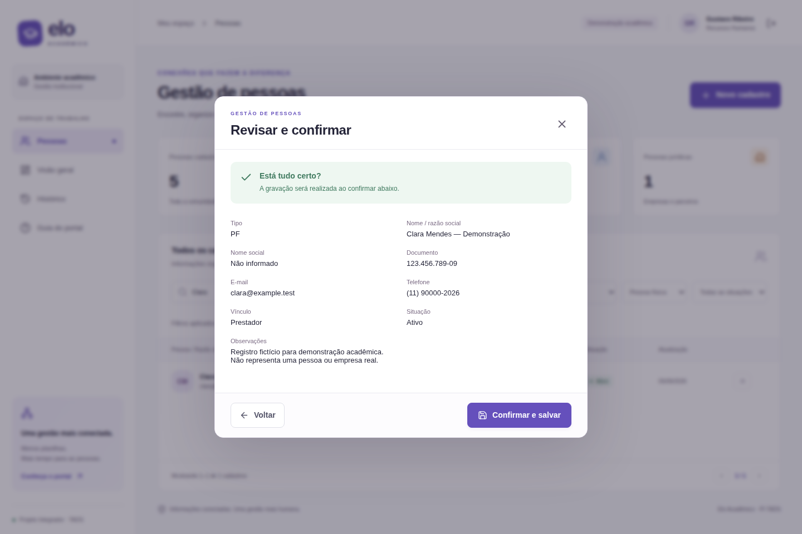
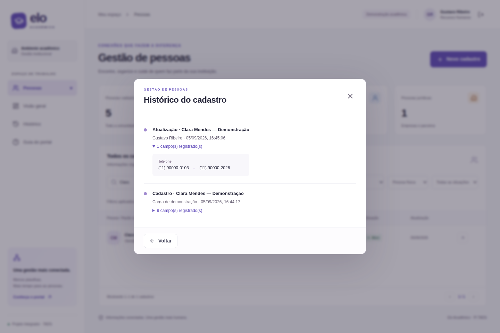

# Evidências de validação

Verificação local em 05/09/2026, Node.js 24.15.0, Next.js 16.3.4 e Chromium instalado pelo Playwright. A execução automatizada usa banco temporário separado do banco local de demonstração.

| Verificação                 | Resultado                                                                                  |
| --------------------------- | ------------------------------------------------------------------------------------------ |
| ESLint                      | Aprovado, sem erros ou avisos no código do projeto                                         |
| TypeScript                  | Aprovado                                                                                   |
| Testes de domínio           | 4 aprovados                                                                                |
| Build de produção           | Aprovado                                                                                   |
| Navegador                   | 6 cenários aprovados                                                                       |
| Acessibilidade automatizada | Sem violações detectadas nas regras WCAG A/AA selecionadas para login, painel e formulário |
| Vídeo                       | MP4, 54,96 segundos, demonstração real com legendas                                        |
| Dados locais e senhas       | Fora do versionamento por `.gitignore`                                                     |

Cenários do navegador: proteção de rotas e login inválido; fluxo de trabalho do RH com gravação e recarga; cadastro PJ, documento inválido, duplicidade, inativação e busca sem resultado; cancelamento, permissão e conflito de edição; navegação em 390 px e ausência de erros JavaScript; verificação automatizada de acessibilidade.

Os testes de domínio verificam CPF/CNPJ numérico, restrições de PJ e e-mail, persistência, unicidade, auditoria, concorrência e hash de senha. Capturas reais foram inspecionadas visualmente; um excesso horizontal da tabela na tela móvel foi corrigido e incluído na regressão.

O resultado do axe-core não certifica acessibilidade integral. Não foram realizados testes de carga, auditoria externa de segurança, pesquisa com usuários reais ou homologação institucional. As evidências demonstram o funcionamento da PoC no ambiente descrito.
